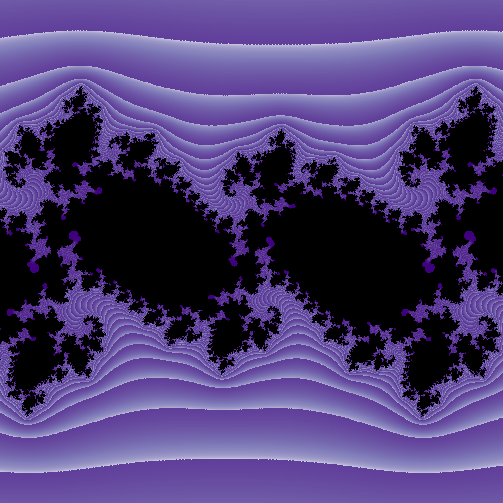

# Fractal Generator

This repository contains a Python script for generating fractal images. It also includes a setup script to ensure all necessary libraries are installed.

## Setup

To set up the required Python libraries, run the `setup.sh` script:

This script detects your operating system and installs the necessary Python libraries (`numpy`, `joblib`, `matplotlib`) using the appropriate package manager (`apt` for Linux, `brew` for macOS).

If you're using Windows, please ensure that you have Python installed and install the required libraries (`numpy`, `joblib`, `matplotlib`) manually using pip.

## Usage

1. Modify the parameters of the fractal in the `fractal.py` file according to your preferences.
2. Run the `fractal.py` script:

This will generate the fractal image based on the parameters you've set.

## Parameters

You can adjust the following parameters in the `fractal.py` file to customize the fractal image:

- `size` : size of the image -> size^2.
- `c_real`: Real coefficient of the julia set.
- `c_imag`: Imaginary coefficient of the julia set.
- `colormap_name`: Colormap used for coloring the fractal.
- `iterations`: Maximum number of iterations for determining if a point belongs to the fractal.
- `contrast`: Contrast between the fractal shape and backround, typically lower values are less vivid but play around to get good colors.

Feel free to experiment with these parameters to create different fractal images.

## Acknowledgements

The content of this repository is heavily inspired by the article ["Intro to Drawing Fractals with Python"](https://nseverkar.medium.com/intro-to-drawing-fractals-with-python-6ad53bbc8208) by Nisha Severkar. 

Please check out the original article for more detailed explanations and insights into fractal generation using Python.

