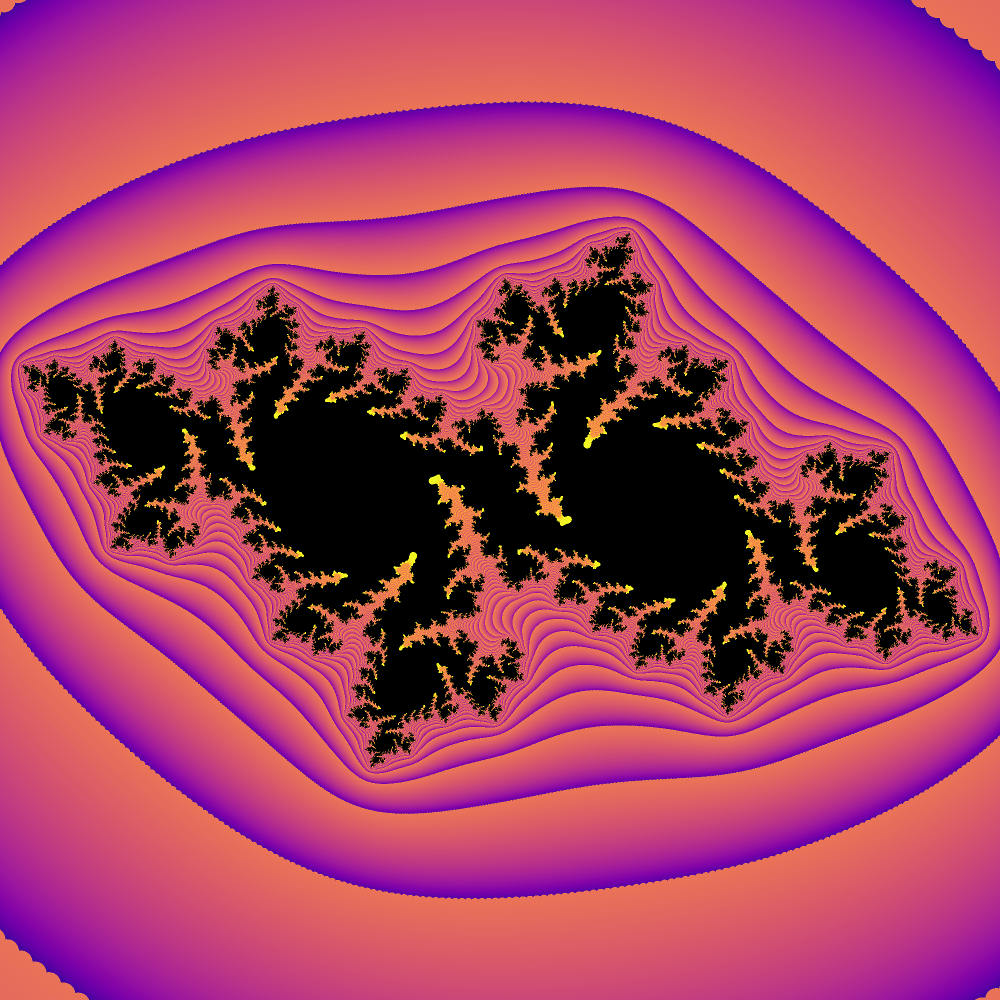

# Fractal Generator

This repository contains a Python script for generating fractal images. It also includes a setup script to ensure all necessary libraries are installed.



## Setup

To set up the required Python libraries, run the `setup.sh` script:

This script detects your operating system and installs the necessary Python libraries (`numpy`, `joblib`, `matplotlib`) using the appropriate package manager (`apt` for Linux, `brew` for macOS).

If you're using Windows, please ensure that you have Python installed and install the required libraries (`numpy`, `joblib`, `matplotlib`) manually using pip.

## Parameters

You can adjust the following parameters in the `fractal.py` file to customize the fractal image:

- `c_real`: The real part of the complex constant defining the Julia set.
- `c_imag`: The imaginary part of the complex constant defining the Julia set.
- `colormap_name`: The name of the colormap used for coloring the fractal. You can change this to any valid colormap name available in Matplotlib.
- `iterations`: The maximum number of iterations for determining if a point belongs to the fractal. This parameter controls the level of detail in the fractal image. NOTE: This does not have any real effect on the output image from my tests, I typically keep it ~1000
- `size`: The size of the generated image in pixels. The image will be square with dimensions `size` x `size`.
- `contrast`: The contrast of the colormap. This parameter adjusts the contrast of the colors in the fractal image.

Feel free to experiment with these parameters to create different fractal images.

## Color Palettes

The `colormap_name` parameter in the `fractal.py` file allows you to choose from various color palettes to colorize the generated fractal images. You can select from the following categories:

### Diverging
- Options: PiYG, PRGn, BrBG, PuOr, RdGy, RdBu, RdYlBu, RdYlGn, Spectral, coolwarm, bwr, seismic

### Perceptually Uniform Sequential
- Options: viridis, plasma, inferno, magma, cividis

### Sequential
- Options: Greys, Purples, Blues, Greens, Oranges, Reds, YlOrBr, YlOrRd, OrRd, PuRd, RdPu, BuPu, GnBu, PuBu, YlGnBu, PuBuGn, BuGn, YlGn

### Sequential (2)
- Options: binary, gist_yarg, gist_gray, gray, bone, pink, spring, summer, autumn, winter, cool, Wistia, hot, afmhot, gist_heat, copper

## Coefficients

The `c_real` and `c_imag` parameters in the `fractal.py` file define the real and imaginary parts of the complex constant (`c`) used to generate the Julia set. You can experiment with different coefficients to explore various Julia sets. Here are a few examples of coefficients:

- \( -0.7 + 0.27015i \)
- \( -0.12 - 0.77i \)
- \( 0.25 + 0.00i \)
- \( -0.38 + 0.6i \)

Feel free to adjust the color palette and coefficients according to your preferences to create different fractal images.

## Usage

1. Modify the parameters of the fractal in the `fractal.py` file according to your preferences. You can adjust the Julia function under the `demJulia` method as follows:

    ```python
    def demJulia(p, dp, z, K, R, overflow):
        zk, dk = z, 1
    ```

    `zk` represents the function

2. Run the `fractal.py` script:

    ```bash
    python3 fractal.py
    ```

This will generate the fractal image based on the parameters you've set.

## Acknowledgements

The content of this repository is heavily inspired by the article ["Intro to Drawing Fractals with Python"](https://nseverkar.medium.com/intro-to-drawing-fractals-with-python-6ad53bbc8208) by Nisha Severkar. 

Please check out the original article for more detailed explanations and insights into fractal generation using Python.


